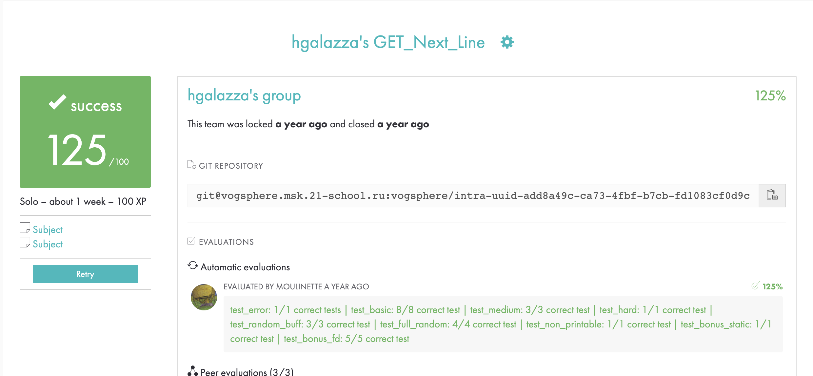

# 42 get_next_line



***
### Challenge

To create a function which returns the next line from a file descriptor each time the function is called, without losing the reading thread.  
  
The project achieved bonus score for using just one static variable, and handling multiple file descriptors without losing thread of reading on any.  
  
The project is very helpful for parsing exercises, in examples where there is one piece of data per line.  
With a simple program, **get_next_line** can behave like `cat`.

For example: The following main:
```c
#include "get_next_line.h"

int   main(int ac, char **av)
{
  char  *line;
  int   fd1;

  fd1 = open(av[1], O_RDONLY);
  while ((get_next_line(fd1, &line)) != 0)
	  printf(RED"%s\n"END, line);
  close(fd1);
  return (0);
}
```
The following would result from the above simple main:
```console
$> ./run_gnl big_bang.txt
Our whole universe was in a hot, dense state
Then nearly fourteen billion years ago expansion started, wait
The earth began to cool, the autotrophs began to drool
Neanderthals developed tools
We built a wall (we built the pyramids)
Math, science, history, unraveling the mysteries
That all started with the big bang! Hey! ...
```
Which would be the same as:
```console
$> cat big_bang.txt
Our whole universe was in a hot, dense state
Then nearly fourteen billion years ago expansion started, wait
The earth began to cool, the autotrophs began to drool
Neanderthals developed tools
We built a wall (we built the pyramids)
Math, science, history, unraveling the mysteries
That all started with the big bang! Hey! ...
```
The function must conform to 21's norm.  
The function cannot leak. All errors must be handled carefully. In no way can the function quit in an unexpected manner (Segmentation fault, bus error, double free, etc).  
Allowed functions are `read`, `malloc` and `free`. Everything else is forbidden.
***

Special thanks to sapril for helping with the bonus part
